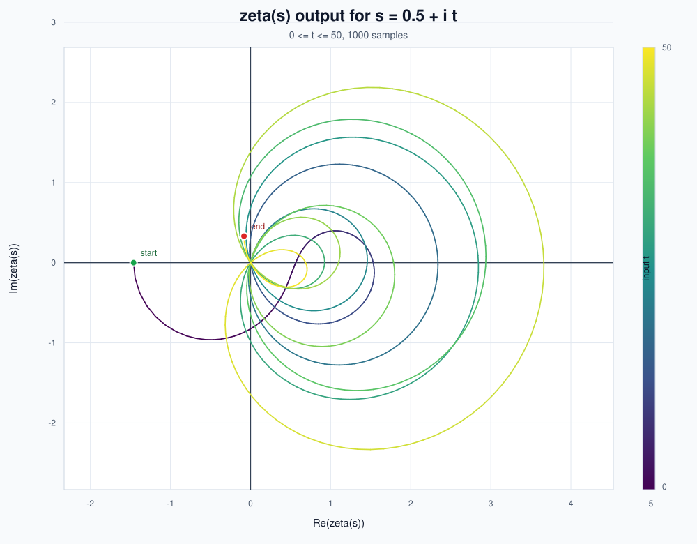
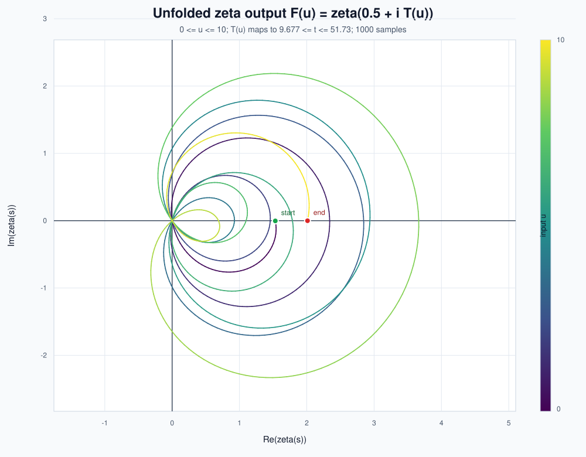

# RH

Tools for exploring the Riemann zeta function on the critical line.

The first script samples

```text
s = 0.5 + i t
```

and plots the output values `zeta(s)` in the complex plane as `t` changes.



The second script uses the unfolded coordinate

```text
F(u) = zeta(0.5 + i T(u))
```

where `T(u)` is the inverse of the average zero-counting function `N_avg(t)`.
This makes the average zero frequency approximately constant in the new input
coordinate `u`.



## Usage

This version uses only Python's standard library and writes an SVG file.

Direct critical-line plot:

```bash
python3 plot_zeta_critical_line.py --t-min 0 --t-max 50 --points 1000 --output zeta_critical_line.svg
```

Unfolded plot:

```bash
python3 plot_zeta_unfolded.py --u-min 0 --u-max 10 --points 1000 --output zeta_unfolded.svg
```

Open the generated SVG in a browser to view the plot.

Useful direct-plot options:

```bash
python3 plot_zeta_critical_line.py \
  --sigma 0.5 \
  --t-min 0 \
  --t-max 100 \
  --points 2000 \
  --terms 128 \
  --output zeta_critical_line_0_100.svg
```

Useful unfolded-plot options:

```bash
python3 plot_zeta_unfolded.py \
  --u-min 0 \
  --u-max 25 \
  --points 2500 \
  --terms 160 \
  --output zeta_unfolded_u_0_25.svg
```

## How It Works

The scripts evaluate the zeta function via the Dirichlet eta function:

```text
zeta(s) = eta(s) / (1 - 2^(1 - s))
```

It then accelerates the alternating eta series with Euler's transformation.
For larger `t` ranges, increase `--terms` to improve numerical stability.

The SVG colors the curve by the input value `t`, with green marking the start
and red marking the end.

The unfolded script uses the average Riemann-von Mangoldt zero-counting
function:

```text
N_avg(t) = t/(2*pi) * log(t/(2*pi)) - t/(2*pi) + 7/8
```

Then it solves `N_avg(t) = u` numerically to get `T(u)`. Plotting
`zeta(0.5 + i T(u))` means one unit of `u` corresponds to roughly one expected
zero. This controls the average zero density, not the exact local spacing.
